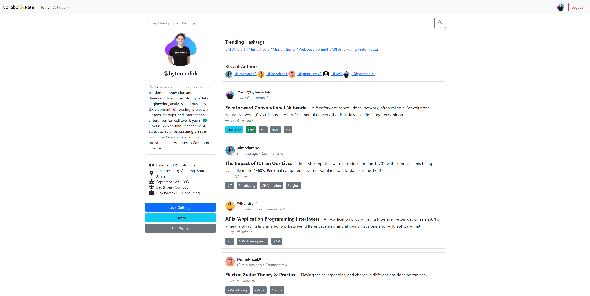
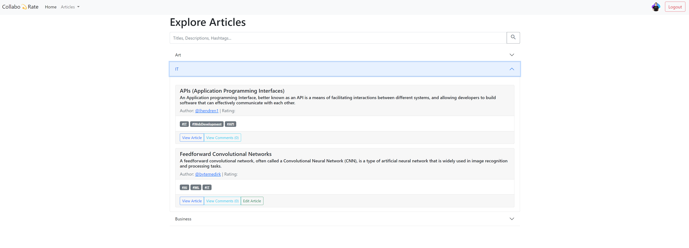
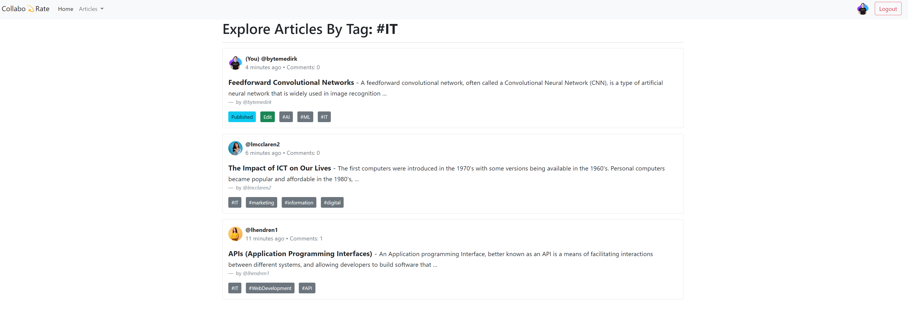
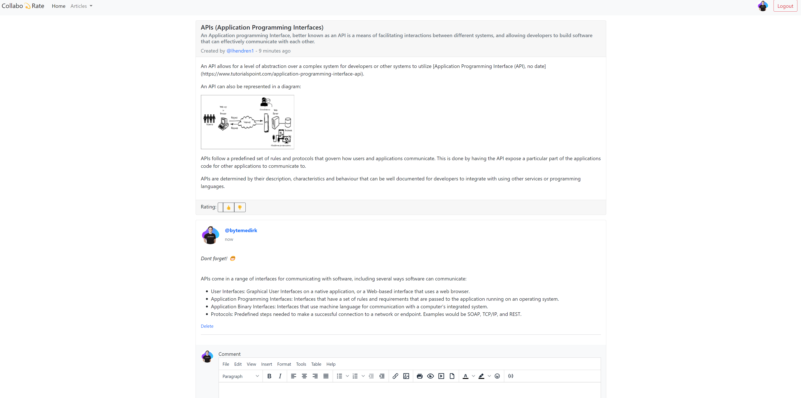
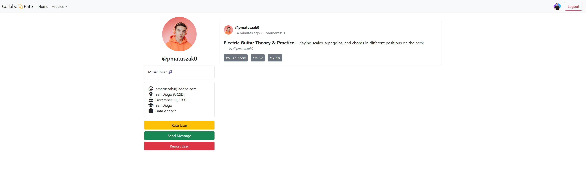

# CollaboRate

A Federated Knowledge Sharing Platform, where you can explore and share articles on various topics.
The difference is that the site will be using a grading matrix for users and the articles they post.
This means the validity, quality and other aspects of the article will be rated by the users of the 
site, and users who have a higher rating will have more weight in their rating of the article.

Users below a certain rating will not be able to rate articles, but will be able to read them. They will also not
be able to post articles, but will be able to comment on them. 

User posts, post frequency, post quality, comments, comment quality, and other aspects will be taken into account
when calculating the user rating, along with users interactions with other users and their posts.

The result is a platform where users can share knowledge and learn from each other, while also being able to
filter out the noise and get the best content. 

This is till a WIP, and the project is still in its early stages. 

## Some of the basic features that will be implemented:

### User Home Page
The user home page will be the first page the user sees when they log in. It will contain a feed of articles
that the user can read, and a list of articles that the user has posted. The user will also be able to post
articles from this page.

## Exploring Articles
The user will be able to explore articles by clicking on the explore button on the navigation bar. This will
take them to a page where they can see a list of articles, and filter them by topic. They will also be able to
sort the articles by rating, date, and other factors.

## Explore by Tags
The user will be able to explore articles by tags. This will take them to a page where they can see a list of
tags, and filter them by topic. They will also be able to sort the tags by rating, date, and other factors.

## Article Reading and Commenting
The user will be able to read articles by clicking on the article title. This will take them to a page where
they can read the article, and comment on it. They will also be able to rate the article, and see the rating
of the article.

## Viewing other Users
The user will be able to view other users by clicking on the user name. This will take them to a page where
they can see the user's profile, and a list of articles that the user has posted. The user will also be able
to rate the user, and see the rating of the user.

